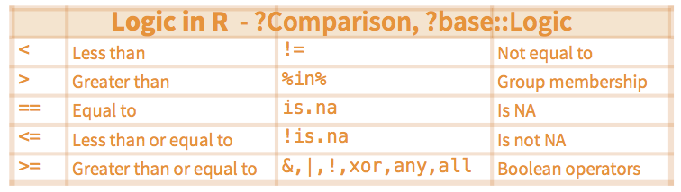
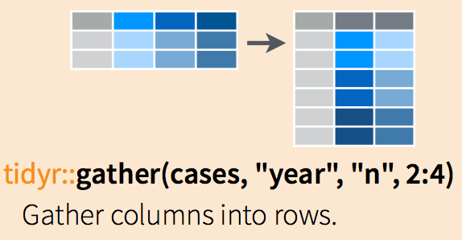
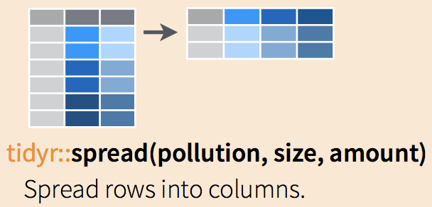

# Data Wrangling with `dplyr` and `tidyr`

The package `dplyr` is an R package for making tabular data wrangling easier by using a limited set of functions that can be combined to extract and summarize insights from your data. It pairs nicely with the package `tidyr`, enabling you to swiftly convert between different data formats (long vs. wide) for plotting and analysis.

`dplyr` is built to work directly with dataframes, with many common tasks optimized by being written in a compiled language (C++) (not all R packages are written in R!).

The package `tidyr` addresses the common problem of reshaping your data for plotting and use by different R functions. Sometimes we want data sets where we have one row per measurement. Sometimes we want a dataframe where each measurement type has its own column, and rows are instead more aggregated groups. Moving back and forth between these formats is nontrivial, and `tidyr` gives you tools for this and more sophisticated data wrangling.

## Learning `dplyr`

```{R,  results='hide', warning=FALSE, message=FALSE}
# Load the tidyverse
library(tidyverse)
library(dplyr)
```

Below we will work on COVID-19 county level infected count data, and we can obtain the data from Github R package `slid`.

```{R,  results='hide', warning=FALSE, message=FALSE}
# Install the slid package from github
# library(devtools)
# devtools::install_github('covid19-dashboard-us/slid')
# Load objects in I.county into my workspace
library(slid)
data(I.county)

# preview the data
# View(I.county)
```

We’re going to learn some of the most common `dplyr` functions:

* `select()`: subset columns
* `filter()`: subset rows on conditions
* `mutate()`: create new columns by using information from other columns
* `group_by()` and `summarize()`: create summary statistics on grouped data
* `arrange()`: sort results
* `count()`: count discrete values

## Selecting columns and filtering rows

1. To select columns of a dataframe, use `select()`. The first argument to this function is the dataframe (`I.county`), and the subsequent arguments are the columns to keep, separated by commas. Alternatively, if you are selecting columns adjacent to each other, you can use a `:` to select a range of columns, read as “select columns from __ to __.”

```{R, eval=TRUE, results='hide', warning=FALSE, message=FALSE}
# load the tidyverse
dplyr::select(I.county, ID, County, State)
# to select a series of connected columns
dplyr::select(I.county, ID, County, State, 
              X2020.12.11:X2020.12.01)
```

2. To choose rows based on specific criteria, we can use the `filter()` function. The arguments after the dataframe are the condition(s) we want for our final dataframe to adhere to (e.g. `State` name is “Iowa”). We can chain a series of conditions together using commas between each condition.

```{R, results='hide'}
# all Iowa counties
dplyr::filter(I.county, State == "Iowa")
```

3. Here is an example of `filter()` function with multiple conditions: 

```{R, eval=TRUE, results='hide'}
# multiple conditions: all Iowa counties with cumulative 
# infection count > 10000
dplyr::filter(I.county, State == "Iowa", 
              X2020.12.11 > 10000)
```

Figure \@ref(fig:logic) shows some commonly used R logic omparisons

```{r logic, out.width = "75%", echo=FALSE, fig.align = "center", fig.cap="Some commonly used logic comparisons."}

```

## Pipes

What if you want to select and filter at the same time? There are three ways to do this: use intermediate steps, nested functions, or pipes.

With intermediate steps, you create a temporary dataframe and use that as input to the next function, like this:

```{R eval=TRUE}
Iowa.I.county <- 
  dplyr::filter(I.county, State == "Iowa")
Iowa.I.county.DEC <- 
  dplyr::select(Iowa.I.county, X2020.12.11:X2020.12.01)
```

This is readable, but can clutter up your workspace with lots of objects that you have to name individually. With multiple steps, that can be hard to keep track of.

You can also nest functions (i.e. one function inside of another), like this:

```{R, eval=TRUE, results='hide'}
Iowa.I.county.DEC <- 
  dplyr::select(dplyr::filter(I.county, State == "Iowa"), 
                ID, County, State, X2020.12.11:X2020.12.01)
```

This is handy but can be difficult to read if too many functions are nested, as R evaluates the expression from the inside out (in this case, filtering, then selecting).

The last option, **pipes**, are a recent addition to R. **Pipes** let you take the output of one function and send it directly to the next, which is useful when you need to do many things to the same dataset. Pipes in R look like `%>%` and are made available via the `magrittr` package, installed automatically with `dplyr`.

```{R results='hide'}
I.county %>%
  dplyr::filter(State == "Iowa") %>%
  dplyr::select(ID, County, X2020.12.11:X2020.12.01)
```

In the above code, we use the **pipe** to send the interviews dataset first through `filter()` to keep rows for the state of Iowa, then through `select()` to keep only the count in December. Since `%>%` takes the object on its left and passes it as the first argument to the function on its right, we don't need to explicitly include the `dataframe` as an argument to the `filter()` and `select()` functions anymore.

Some may find it helpful to read the pipe like the word "then". For instance, in the above example, we take the dataframe `I.county`, then we filter for rows with `State == "Iowa"`, then we select columns from `X2020.12.11` to `X2020.12.01`. The `dplyr` functions are somewhat simple, but by combining them into linear workflows with the pipe, we can accomplish more complex data wrangling operations.

If we want to create a new object with this smaller version of the data, we can assign it a new name:

```{R eval=TRUE}
Iowa.I.county.DEC <- I.county %>%
  dplyr::filter(State == "Iowa") %>%
    dplyr::select(ID, County, X2020.12.11:X2020.12.01)

head(Iowa.I.county.DEC)
```

## Select and order top n entries (by group if grouped data).

The function `top_n` can be used to select top (or bottom) n rows (by value).

This is a convenient wrapper that uses `filter()`and `min_rank()` to select the top or bottom entries in each group, ordered by `wt`.

** Usage **

```{r eval=FALSE}
top_n(x, n, wt)
```

** Arguments **
* `x`: a tbl() to filter
* `n`: number of rows to return. If `x` is grouped, this is the number of rows per group. Will include more than `n` rows if there are ties. If `n` is positive, selects the top `n` rows. If negative, selects the bottom `n` rows.
* wt (Optional). The variable to use for ordering. If not specified, defaults to the last variable in the tbl.

This argument is automatically quoted and later evaluated in the context of the data frame. It supports unquoting.

Let us find the top ten counties with the largest cumulative infected count on December 11, 2020. 

```{R eval=TRUE}
library(dplyr)
I.county.top10 <- I.county %>% 
  top_n(10, wt = X2020.12.11)
I.county.top10$County
```

Let us find the top ten counties with the smallest cumulative infected count on December 11, 2020. 

```{R eval=TRUE}
library(dplyr)
I.county.bottom10 <- I.county %>% 
  top_n(-10, wt = X2020.12.11)
I.county.bottom10$County
```

Let us find the county with the largest cumulative infected count on December 11, 2020 for each state. 

```{R eval=TRUE}
library(dplyr)
I.county.top1 <- I.county %>% 
  group_by(State) %>%
  top_n(1, wt = X2020.12.11) %>% 
  dplyr::select(State, County)
```

## Mutate

Frequently you’ll want to create new columns based on the values in existing columns, for example, to obtain the number of daily new cases based on the cumulative count. For this, we’ll use `mutate()`.

```{R eval=TRUE}
I.county.new <- I.county %>% 
    dplyr::filter(State == "Iowa") %>%
    dplyr::select(ID, County, X2020.12.11:X2020.12.10) %>% 
    mutate(Y2020.12.11 = X2020.12.11 - X2020.12.10)

head(I.county.new)
```

If we want to obtain the number of daily new cases based on the cumulative count for the dates in December only, we can try the following:

```{R eval=TRUE}
I.county.Iowa <- I.county %>% 
  dplyr::filter(State == "Iowa")

I.county.tmp = I.county.Iowa[, -(1:3)]
I.county.Iowa.new = I.county.Iowa
I.county.Iowa.new[, -(1:3)] = 
  I.county.tmp - cbind(I.county.tmp[, -1], 0)

I.county.Iowa.DEC = I.county.Iowa.new %>% 
dplyr::select(ID, County, X2020.12.11:X2020.12.01)  

name.tmp = substring(names(I.county.Iowa.DEC)[-(1:2)], 2)
names(I.county.Iowa.DEC)[-(1:2)] = paste0("Y", name.tmp)
head(I.county.Iowa.DEC)
```


## Split-apply-combine data analysis and the `summarize()` function

Many data analysis tasks can be approached using the split-apply-combine paradigm: split the data into groups, apply some analysis to each group, and then combine the results. `dplyr` makes this very easy via the `group_by()` function.

**The `summarize()` function**

`Summarize` uses summary functions, functions that take a vector of values and return a single value, such as:

* `dplyr::first`: First value of a vector.
* `dplyr::last`: Last value of a vector.
* `dplyr::nth`: Nth value of a vector.
* `dplyr::n`: # of values in a vector.
* `dplyr::n_distinct`: # of distinct values in a vector.
* `IQR`: IQR of a vector.
* `min`: Minimum value in a vector.
* `max`: Maximum value in a vector.
* `mean`: Mean value of a vector.
* `median`: Median value of a vector.
* `var`: Variance of a vector.
* `sd`: Standard deviation of a vector.

`group_by()` is often used together with `summarize()`, which collapses each group into a single-row summary of that group. `group_by()` takes as arguments the column names that contain the categorical variables for which you want to calculate the summary statistics. Once the data are grouped, you can also summarize multiple variables simultaneously (and not necessarily on the same variable). So to compute the state level infected count by `State`:

```{R eval=TRUE}
I.state <- I.county %>%
  group_by(State) %>%
  summarize(across(X2020.12.11:X2020.01.22, 
                   ~ sum(.x, na.rm = TRUE)))

head(I.state, 2)
```

or we can use `summarise_at()`, which affects variables selected with a character vector or `vars()`: 

```{R eval=TRUE}
I.state <- I.county %>%
  group_by(State) %>%
  summarize_at(vars(X2020.12.11:X2020.01.22), 
               ~ sum(.x, na.rm = TRUE))

head(I.state, 2)
```

or we can use `summarise_if()`, which affects variables selected with a predicate function:

```{R eval=TRUE}
I.state <- I.county %>%
  group_by(State) %>%
  summarize_if(is.numeric, ~ sum(.x, na.rm = TRUE)) 

head(I.state, 2)
```

It is sometimes useful to rearrange the result of a query to inspect the values. For instance, we can sort on `X2020.12.11` to put the group with the largest cumulative infected count first:

```{R eval=TRUE}
I.state <- I.county %>%
  group_by(State) %>%
  summarize_if(is.numeric, ~ sum(.x, na.rm = TRUE)) %>%
  arrange(desc(X2020.12.11))

head(I.state, 2)
```

## Joins with `dplyr`

R has a number of quick, elegant ways to join data frames by a common column. There are at least three ways:

* Base R’s `merge()` function,
* Join family of functions from `dplyr`, and
* Bracket syntax based on `data.table`.

`dplyr` uses SQL database syntax for its join functions. For example, a **left join** means: Include everything on the left and all rows that match from the right data frame. If the join columns have the same name, all you need is `left_join(x, y)`. If they don’t have the same name, you need a by argument, such as `left_join(x, y, by = c("df1ColName" = "df2ColName"))`. See an illustration in Figure \@ref(fig:lrjoin).

```{r lrjoin, out.width = "30%", echo=FALSE, fig.align = "center", fig.show='hold', fig.cap="An illustration of left join and right join."}
knitr::include_graphics(c("figures/Left.png","figures/Right.png"))
```

Different join functions control what happens to rows that exist in one table but not the other.

* `left_join` keeps all the entries that are present in the left (first) table and excludes any that are only in the right table.
* `right_join` keeps all the entries that are present in the right table and excludes any that are only in the left table.
* `inner_join` keeps only the entries that are present in both tables. `inner_join` is the only function that guarantees you won’t generate any missing entries.
* `full_join` keeps all of the entries in both tables, regardless of whether or not they appear in the other table.

```{r ifjoin, out.width = "30%", echo=FALSE, fig.align = "center", fig.show='hold', fig.cap="An illustration of inner join and full join."}
knitr::include_graphics(c("figures/Inner.png","figures/Full.png"))
```

The join functions are nicely illustrated in RStudio’s [Data wrangling cheatsheet][https://www.rstudio.com/wp-content/uploads/2015/02/data-wrangling-cheatsheet.pdf]. 

```{r join, out.width = "80%", echo=FALSE, fig.align = "center", 
fig.cap="An illustration of the join functions in RStudio’s Data wrangling cheatsheet."}
knitr::include_graphics("figures/dplyr-joins.png")
```

**Toy examples with joins**

```{r collapse=TRUE}
set.seed(12345)
x <- data.frame(key= LETTERS[c(1:3, 5)], 
                value1 = sample(1:10, 4), 
                stringsAsFactors = FALSE)
y <- data.frame(key= LETTERS[c(1:4)], 
                value2 = sample(1:10, 4), 
                stringsAsFactors = FALSE)

x
y
```

```{r collapse=TRUE}
# What's in both x and y?
inner_join(x, y, by = "key")
```

```{r collapse=TRUE}
# What's in X and bring with it the stuff that matches in Y
left_join(x, y, by = "key")
```

```{r collapse=TRUE}
# What's in Y and bring with it the stuff that matches in Y
right_join(x, y, by = "key")
```

```{r collapse=TRUE}
# Give me everything!
full_join(x, y, by = "key")
```

```{r collapse=TRUE}
# Give me the stuff in X that is not in Y
anti_join(x, y, by = "key")
```

```{r collapse=TRUE}
# Want everything that doesn't match?
full_join(anti_join(x, y, by = "key"), anti_join(y, x, by = "key"), by= "key")
```

**Practice with joins for real data**

We first get the data named `pop.county` from the github R package `slid`. Note that there are four variables in this data: `ID`, `County`, `State`, `population`.

```{R, cache = TRUE, warning = FALSE, message = FALSE, collapse = TRUE}
library(slid)
data(I.county)
dim(I.county)
data(pop.county)
dim(pop.county)
```

Now, we would like to join the two tables: `I.county` and `pop.county` using the `left_join` as follows:

```{R, results='hide'}
I.county.w.pop <- left_join(I.county, pop.county, by = "ID") %>%
  dplyr::select(-c("County.y", "State.y"))
```

or we can: 

```{R, cache=TRUE, results='hide'}
I.county.w.pop <- left_join(I.county, 
dplyr::select(pop.county, c(ID,population)), by = "ID")
```

## Reshaping Data - Change the layout of a data set

Sometimes, we want to convert data from a wide format to a long format. Many functions in R expect data to be in a long format rather than a wide format. Programs like SPSS, however, often use wide-formatted data. There are two sets of methods that are explained below:

* `gather()` and `spread()` from the `tidyr` package. This is a newer interface to the `reshape2` package.

* `melt()` and `dcast()` from the `reshape2` package.

Many other methods aren’t covered here since they are not as easy to use.

### From wide to long

Below we would like to change the data `I.state` from wide format to long format.

```{R, cache=TRUE, results='hide', warning=FALSE, message=FALSE}
library(slid)
data(I.state)
names(I.state)
```

**Use `gather(data, key, value, …)`**

* `data` = the dataframe you want to morph from wide to long
* `key` = the name of the new column that is levels of what is represented in the wide format as many columns
* `value` = the name of the column that will contain the values
* `…` = columns to gather, or leave (use -column to gather all except that one)

The `gather` functions are nicely illustrated in RStudio’s [Data wrangling cheatsheet][https://rstudio.com/wp-content/uploads/2015/02/data-wrangling-cheatsheet.pdf] as shown in Figure \@ref(fig:gather).

```{r gather, out.width = "50%", echo=FALSE, fig.align = "center", fig.cap="An illustration of `gather` function."}

```

```{r}
I.state.wide <- I.state %>%
  dplyr::select(State,X2020.12.11:X2020.01.22)
dim(I.state.wide)  

I.state.long <- gather(I.state.wide, DATE, Death, 
X2020.12.11:X2020.01.22, factor_key = TRUE) %>% 
                       arrange(State)
dim(I.state.long)
```

**Use `pivot_longer()`**

The function `pivot_longer()` is an updated approach to `gather()`, designed to be both simpler to use and to handle more use cases. It is recommended to use `pivot_longer()` for new code; `gather()` isn't going away but is no longer under active development.

```{r}
I.state.wide <- I.state %>%
  dplyr::select(State,X2020.12.11:X2020.01.22)
dim(I.state.wide) 

I.state.long <- I.state.wide %>%
  pivot_longer(X2020.12.11:X2020.01.22, 
  names_to = "DATE", values_to = "Death")
```

See more complicated examples from the [introduction of 'tidyr' package](https://tidyr.tidyverse.org/reference/pivot_longer.html).

### From long to wide

Now let's change the data back to the wide format, and we can use `spread`.

**Use `Use spread(data, key, value)`**

* `data` = the dataframe you want to morph from long to wide
* `key` = the name of the column that contains the key
* `value` = the name of the column contains the values

The `spread` functions are nicely illustrated in RStudio’s [Data wrangling cheatsheet][https://rstudio.com/wp-content/uploads/2015/02/data-wrangling-cheatsheet.pdf] as shown in Figure \@ref(fig:spread).

```{r spread, out.width = "50%", echo=FALSE, fig.align = "center", fig.cap="An illustration of `spread` function."}

```

```{r}
I.state.wide <- spread(I.state.long, DATE, Death)
dim(I.state.wide)
```

**Use `pivot_wider()`**

We can also use the function `pivot_wider()`, which "widens" data, increasing the number of columns and decreasing the number of rows. The inverse transformation is `pivot_longer()`.

```{r}
I.state.wide <- I.state.long %>%
pivot_wider(names_from = DATE, values_from = Death)
dim(I.state.wide)
```

See more complicated examples from the [introduction of 'tidyr' package](https://tidyr.tidyverse.org/reference/pivot_longer.html).

## Exercises

We are going to explore the basic data manipulation verbs of `dplyr` using
`nycflights13::flights`. Install the R package `nycflights13`.

```{R, eval=TRUE}
library(nycflights13)
data(flights)
names(flights)
```

Next, use `?flights` to see more detailed information about this dataset. 

1. Select `dep_time`, `dep_delay`, `arr_time`, and `arr_delay` from flights.
2. Find all flights on January 1st.
3. Find all flights that departed in December.
4. Find all flights that flew to Houston.
5. Find all flights that were operated by United, American, or Delta.
6. Sort flights to find the most delayed flights. Find the flights that left earliest.
7. What does the following code provide?

```{R, eval=FALSE}
delays <- flights %>% 
  group_by(dest) %>% 
  summarise(
    count = n(),
    dist = mean(distance, na.rm = TRUE),
    delay = mean(arr_delay, na.rm = TRUE)
  )
```

8. What does the following code provide?

```{R, eval=FALSE}
by_day <- group_by(flights, year, month, day)
summarize(by_day, delay = mean(dep_delay, na.rm = TRUE))
```
