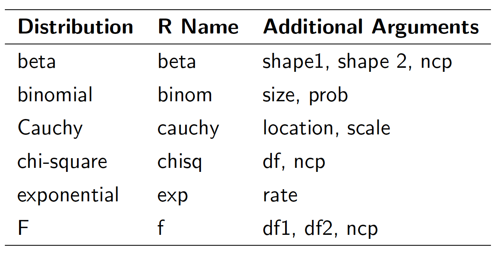

# Simulations

Simulation is an important (and big) topic for both statistics and for a variety of other areas where there is a need to introduce randomness. Sometimes you want to implement a statistical procedure that requires random number generation or sampling (i.e. Markov chain Monte Carlo, the bootstrap, random forests, bagging) and sometimes you want to simulate a system and random number generators can be used to model random inputs.

R comes with a set of pseuodo-random number generators that allow you to simulate from well-known probability distributions like the Normal, Poisson, and binomial. Some example functions for probability distributions in R.

## Probability Distributions and Generating Random Variables

One convenient use of R is to provide a comprehensive set of statistical tables. Functions are provided to evaluate the cumulative distribution function $P(X \leq x)$, the probability density function and the quantile function (given q, the smallest x such that $P(X \leq x) > q$), and to simulate from the distribution.

R provides four types of functions for dealing with distributions. Each type begins with a letter designating its purpose, followed by
a name specifying the distribution.

* `p` - probability (argument is deviate, returns probability)
* `d` - density (argument is deviate, returns density value)
* `q` - quantile function (argument is probability - returns deviate)
* `r` - random numbers (argument is n, returns vector of random numbers)

**Popular Distributions**

Figure \@ref(fig:popdist) shows some popular distributions that we might use them often.

```{r popdist, out.width = "60%", echo=FALSE, fig.align = "center", fig.cap="Popular distributions."}

```

Prefix the name given here by ‘d’ for the density, ‘p’ for the CDF, ‘q’ for the quantile function and ‘r’ for simulation (random deviates). The first argument is `x` for `dxxx`, q for `pxxx`, `p` for `qxxx` and `n` for `rxxx` (except for `rhyper` and `rwilcox`, for which it is `nn`, for example, `rwilcox(nn,m,n)`). In not quite all cases is the non-centrality parameter ncp are currently available: see the on-line help for details. 

In not quite all cases is the non-centrality parameter ``ncp`` are currently available: see the on-line help for details.

```{r, eval=TRUE, collapse = TRUE}  
# 2-tailed p-value for t distribution
2 * pt(-2.43, df = 13)
# upper 1% point for an F(2, 7) distribution
qf(0.01, 2, 7, lower.tail = FALSE)
```

## More Examples

The following are some simple examples.

1. Uniform

Uniform numbers are ones that are "equally likely" to be in the specified range. Often these numbers are in [0, 1] for computers, but in practice can be between [a, b] where a, b depend upon the problem. An example might be the time you wait at a traffic light. This might be uniform on [0, 2].

```{r, eval=TRUE, collapse = TRUE}  
runif(1, 0, 2) # time at light
runif(5, 0, 2) # time at 5 lights
runif(5) # 5 random numbers in [0,1]
```

2. Binomial

The binomial random numbers are discrete random numbers. They have the distribution of the number of successes in `n` independent Bernoulli trials where a Bernoulli trial results in success or failure, success with probability `p`.

```{r, eval=TRUE, collapse = TRUE}  
# Compute P(X <= 5) for X Binomial(8, 0.9)
pbinom(5, 8, 0.9)
# Compute P(45 < X < 55) for X Binomial(100, 0.5)
pbinom(54, 100, 0.5) - pbinom(45, 100, 0.5)
# Find the 0.05 quantile for X Binomial(16, 0.5)
qbinom(0.05, 100, 0.5)
# Generate 100 random variables from Binomial(20, 0.2)
rbinom(100, 20, 0.2)
```

3. Normal

```{R, eval=TRUE, collapse = TRUE} 
# Find P(Z <= 1.5). 
pnorm(1.5)
# Find the 0.05-quantile for N(0, 1) 
qnorm(0.05)
#Find the 0.05-quantile for N(1, 4) 
qnorm(0.05, mean = 1, sd = 2)
# Generate 50 random variables from N(4, 2)
rnorm(50, 4, 2)
```

4. The Poisson distribution is commonly used to model data that come in the form of counts.

```{R, eval=TRUE, collapse = TRUE} 
rpois(10, 1)    ## Counts with a mean of 1
rpois(10, 2)    ## Counts with a mean of 2
rpois(10, 20)   ## Counts with a mean of 20
```

## Setting Random Number Seed

When simulating any random numbers it is essential to set the random number seed. Setting the random number seed with set.seed() ensures reproducibility of the sequence of random numbers.

For example, I can generate 5 Normal random numbers with `rnorm()`.

```{R, eval=TRUE, collapse = TRUE}
set.seed(1)
rnorm(5)
```

Note that if I call `rnorm()` again I will of course get a different set of 5 random numbers.

```{R, eval=TRUE, collapse = TRUE}
rnorm(5)
```

If I want to reproduce the original set of random numbers, I can just reset the seed with `set.seed()`.

```{R, eval=TRUE, collapse = TRUE}
set.seed(1)
rnorm(5)    ## Same as before
```

In general, you should always set the random number seed when conducting a simulation! Otherwise, you will not be able to reconstruct the exact numbers that you produced in an analysis.

## Example: Normal Approximation to the Binomials

In our introductory level statistics, we know that we can use normal to approximate binomials. For example, X ~ BINOM(100, 0.4), let us use the binomial functions and normal approximations in R to compute $P(35 < X \leq 45)$.

We first use the binomial functions in R to compute $P(35 < X \leq 45)$

```{R eval=TRUE} 
pbinom(45, 100, .4) - pbinom(35, 100, .4)
```

Now according to the normal approximation and the continuity correction, we can use the normal functions in R to compute P(35.5 < X ≤ 45.5):

```{R eval=TRUE} 
mu <- 100 * .4
sig <- sqrt(100 * .4 * (1 - .4))
pnorm(45.5, mu, sig) - pnorm(35.5, mu, sig)
```

## Random Sampling using `sample`


R has the ability to sample with and without replacement. That is, choose at random from a collection of things such as the numbers 1 through 6 in the dice rolling example. The sampling can be done with replacement (like dice rolling) or without replacement (like a lottery). By default sample samples without replacement each object having equal chance of being picked. You need to specify replace=TRUE if you want to sample with replacement. Furthermore, you can specify separate probabilities for each if desired.

The `sample()` function draws randomly from a specified set of (scalar) objects allowing you to sample from arbitrary distributions of numbers.

Here are some examples:

```{R, eval=TRUE, collapse = TRUE} 
# Roll a die
sample(1:6, 10, replace = TRUE)
## toss a coin
sample(c("H", "T"), 10, replace = TRUE)
## pick 6 of 54 (a lottery)
sample(1:54, 6) # no replacement
## pick a card. (Fancy! Uses paste, rep)
cards <- paste(rep(c("A", 2:10, "J", "Q", "K"), 4),
               c("H", "D", "S", "C"))
# a pair of jacks, no replacement
sample(cards, 5) 
```

## A Simulation Example

1. Toss a single die 1000 times, each time note down the number that showed up. Find the distribution of the 1000 observations

```{R hh1, eval=TRUE, out.width='75%', fig.align='center', fig.cap="A histogram based on 1000 roles of a single die."}
# distributions of a single six sided die
# generate a uniform random distribution from min to max
numcases <- 1000    #how many cases to generate
min <- 1            #set parameters
max <- 6
# generate random uniform numcases numbers from min to max 
x <- sample(1:6, numcases, replace = TRUE)    
# show the histogram
hist(x,prob = T, xlim = range(min - .5, max + .5),
     main = paste(numcases," roles of a single die"),
     breaks = seq(min - .5, max + .5, 1))  
```

2. Toss two dice 1000 times, each time note down the number that showed up and compute the average of the two dice. Find the distribution of the 1000 sample means

```{R hh2, eval=TRUE, out.width='75%', fig.align='center', fig.cap="A histogram based on 1000 roles of a pair of dice."}
# generate a uniform random distribution from min to max 
# for numcases sample size 2
numcases <- 1000      #how many cases to generate
min <- 1              #set parameters
max <- 6
x1 <- sample(1:6, numcases, replace=TRUE)
x2 <- sample(1:6, numcases, replace=TRUE)       
x.bar <- (x1 + x2) / 2
hist(x.bar, prob = T, xlim = range(min - .5, max + .5),
     main = paste(numcases, " roles of a pair of dice"))
```

3. Toss k dice 1000 times, each time note down the number that showed up and compute the average of the k dice. Find the distribution of the 1000 sample means

```{R hh3, eval=TRUE, out.width='75%', fig.align='center', fig.cap="A histogram based on 1000 roles of 100 dice."} 
# Toss k=100 dice
k <- 100
numcases <- 1000               #how many samples to take? 
min <- 1                       #lowest value
max <- 6
sum <- rep(0,numcases)
for(i in 1:k){
	dice <- sample(1:6, numcases, replace=TRUE)
	sum <- sum + dice
}
x.bar <- sum / k
hist(x.bar, prob = T, xlim = range(min - .5, max + .5),
     main = paste( numcases," roles of 100 dice")) 
```

## Basics of Simulation

We have seen that we can use `runif` (uniform), `rpois` (poisson), `rnorm` (normal), `rbinom` (binomial), `rgamma` (gamma), `rbeta` (beta), ..., to generate random numbers from known distribution. 

* First argument for all is `n`, number of samples to generate.
* Then, parameters of the distribution (always check that the distribution is parameterised the way you expect).

In this section, we focus on repeating the simulation multiple times.

### Repetition

1. Use the `replicate` function

```{R, eval=FALSE}
replicate(n, expression)
```

Find the mean of 100 random standard normal numbers, and repeat it 10 times
```{R, eval=TRUE}
replicate(10, mean(rnorm(100)))
```

Find the mean of 10 random standard normal numbers, repeat it 100 times, and draw the histgram of 100 means

```{R hh4, eval=TRUE, out.width='75%', fig.cap="Histogram of the mean of 10 random standard normal numbers based on 100 replications."}
hist(replicate(100, mean(rnorm(10))))
```

2. Simulation -- The Central Limit Theorem

In our introductory level statistics, we also learned the central limit theorem (CLT): if $X_i$ are drawn independently from a population where $\mu$ and $\sigma$ are known, then
\[
\frac{\bar{X}-\mu}{\sigma/\sqrt{n}}
\]
is asymptotically normal with mean 0 and variance 1. That is, if $n$ is large enough the average is approximately normal with mean $\mu$ and standard deviation $\sigma/\sqrt{n}$.

How can we check this? **Simulation** is an excellent way. Let's investigate. Suppose we start with a skewed distribution, the CLT says that the average will eventually look normal. That is, it is approximately normal for large $n$. What does “eventually” mean? What does “large” mean?

An example of a skewed distribution is the exponential. Note that the exponential distribution has standard deviation equal to its mean, so we only need to specify the mean. To generate a function of exponential distribution with mean 10 (standard deviation is also 10 then)

```{R, eval=FALSE} 
rexp(n, 1 / 10)
```

Here is a function to create a single standardized average based on $n=5$ exponential random variables with mean 10:

```{R, eval=TRUE}
f  <- function(n = 5, mu = 10) {
  (mean(rexp(n, 1 / mu)) - mu) / (mu/sqrt(n))
}
```

But that is only one of these random numbers. We really want lots of them to see their distribution. How can we create 100 of them? We can use `for` loops.

```{R, eval=TRUE}
results  <- replicate(100, f(5, 10))
```

We can view the results with a histogram:

```{R hh5, eval=TRUE, out.width='75%', fig.cap="Histogram of the mean of 5 random exponential variables with mean 10 based on 100 replications."}
xvals <- seq(-3, 3, .01) # for the density plot
hist(results, probability = TRUE, main = "n=5", col = gray(.95))
# plot normal curve
points(xvals, dnorm(xvals, 0, 1), type="l") 
```

Repeat the above for $n=15,~30,~50,~100$. The histogram becomes very bell shaped between $n=15$ and $n=50$, although even at $n=50$ it appears to still be a little
skewed.

Let us put the above together.

```{R hh6, eval=TRUE, out.width='75%', fig.cap="Histogram of the mean of 5 (left) or 50 (right) random exponential variables with mean 10 based on 100 replications."}

# create a single standardized average based on n exponential  
# random variables with mean mu:
par(mfrow = c(1,2))

f = function(n, mu) {
 (mean(rexp(n, 1 / mu)) - mu) / (mu / sqrt(n))
}

# sample size n=5, mu=10, repeat 100 times
xvals <- seq(-3, 3, .01) # for the density plot
hist(replicate(100, f(5, 10)), probability = TRUE, 
     main = "n=5", col = gray(.95))
# plot normal curve
points(xvals, dnorm(xvals, 0, 1), type = "l") 

# sample size n=50, repeat 100 times 
xvals = seq(-3, 3, .01) # for the density plot
hist(replicate(100, f(50, 10)), probability = TRUE, 
     main = "n=50", col = gray(.95))
# plot normal curve
points(xvals,dnorm(xvals, 0, 1), type = "l") 
```

You can also build up a function to achieve the above simulation goals.

```{R, eval=FALSE}
sim1 = function(n){
	hist(replicate(n, mean(rnorm(100))))
}

sim2 = function(n, m){
	hist(replicate(n, mean(rnorm(m))))
}

sim3 = function(n, m, d){
	if(d=="gaussian"){
		hist(replicate(n, mean(rnorm(m))))
	}
	if(d=="uniform"){
		hist(replicate(n, mean(runif(m))))
	}
}
```

## Exercises

1. Generate 10 random numbers from a uniform$(0,10)$. Use R to find the maximum and minimum values. 

2. Generate 10 random normal numbers with mean 5 and standard deviation 5 ($N(5,5^2)$). How many are less than 0? (Use R)

3. Select 6 numbers from a lottery containing 49 balls. What is the largest number? What is the smallest? [Hint: `sample(1:49,6)`]

4. Answer these using R.
   (a) For normal$(0,1)$, find a number $z^{\ast}$  solving $P (Z < z^{\ast}) = 0.05$ (use `qnorm`).
   (b) For normal$(0,1)$, find a number $z^{\ast}$ solving $P (-z^{\ast}< Z< z^{\ast}) = 0.05$ (use `qnorm` and symmetry).
   (c) How much area (probability) is to the right of 1.5 for a $N(0,2^2)$?

5. Toss a fair coin 50 times (using R). How many heads do you have?

6. Generate the data from normal distribution: one dataset with $n =100$, mean = 10 and standard deviation = 10, the other dataset with $n =100$, mean = 100 and standard deviation = 100. Make the histograms for the two datasets and compare the two distributions. How are they different? How are they similar? Are both approximately normal?

